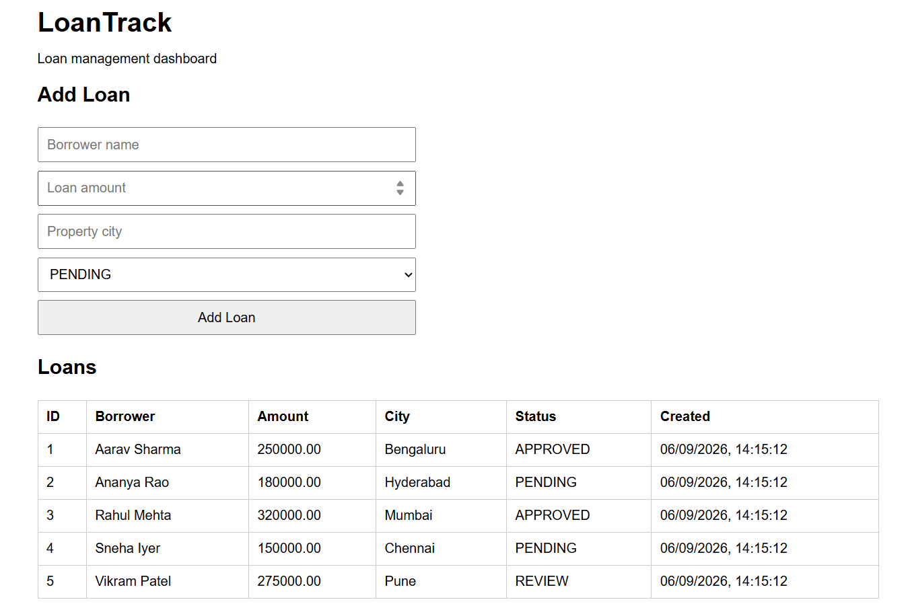
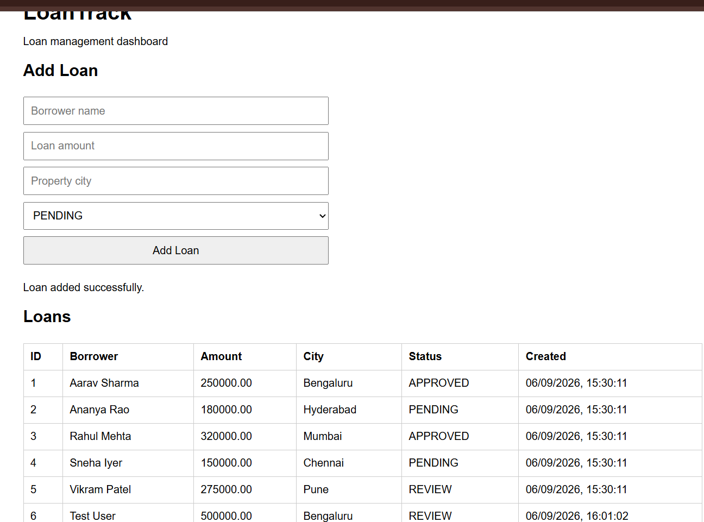

# LoanTrack Evidence

This document records the commands and observed results used to verify the Docker Compose and Kubernetes implementation. The outputs below are based on the tests performed during development.





---

# Part B — Docker Evidence

## B1. Docker Images

The application images were built successfully.

Observed image sizes:

```text
loantrack-backend:v1     262 MB
loantrack-frontend:v1    92.6 MB
```

The backend image is below the required 300 MB limit.

---

## B2. Non-Root Container Execution

The backend container was inspected and executed as the dedicated non-root application user.

Command:

```bash
docker exec <backend-container> whoami
```

Observed result:

```text
loantrack
```

The backend image therefore does not run the application as root.

---

## B3. Docker Compose Health

The complete three-tier application was started with Docker Compose.

Expected architecture:

```text
Browser
   |
   v
Frontend / Nginx
   |
   | HTTP
   v
Backend / FastAPI
   |
   | PostgreSQL connection
   v
PostgreSQL
```

The Compose services reached healthy/running state, with the frontend exposed on:

```text
http://localhost:8080
```

The frontend communicates with the backend through the Compose service name rather than an IP address.

---

## B4. Backend Health and Readiness

The backend exposes separate health endpoints:

```text
/healthz  -> process/application health
/readyz   -> database readiness
```

The backend healthcheck was configured in the Docker image.

Observed health responses during testing:

```json
{"status":"ok"}
```

```json
{"status":"ready"}
```

---

## B5. Browser-to-Database Flow

The browser UI successfully displayed the five seeded loans.

A new loan was added through the browser UI. The same newly created record was then queried directly from PostgreSQL.

This verified the complete path:

```text
Browser
  -> Frontend
  -> Backend HTTP API
  -> PostgreSQL
```

and also verified that the frontend does not connect directly to PostgreSQL.

---

## B6. PostgreSQL Persistence

The PostgreSQL data was tested across a normal Compose restart.

The stack was stopped with:

```bash
docker compose down
```

and started again with:

```bash
docker compose up -d
```

The database data remained available because PostgreSQL uses the named Docker volume:

```text
postgres_data
```

By contrast:

```bash
docker compose down -v
```

removes the named volume and therefore removes the persisted database data.

---

## B7. Backend Startup Retry and Backoff

A separate Docker test intentionally started the backend before its PostgreSQL dependency.

The backend initially could not resolve/connect to the database and logged retry attempts.

Observed log sequence included:

```text
Starting LoanTrack backend...
Initializing database connection pool...

Database connection attempt 1/10 failed:
couldn't get a connection after 30.00 sec

Retrying in 1.0 seconds...

Database connection established on attempt 2.
LoanTrack backend is ready.
INFO: Application startup complete.
INFO: Uvicorn running on http://0.0.0.0:8000
```

The initial failures included:

```text
[Errno -2] Name or service not known
```

and later:

```text
connection refused to 172.18.0.3:5432
```

After PostgreSQL became available, the backend recovered without being restarted manually.

Final checks returned:

```json
{"status":"ok"}
```

and:

```json
{"status":"ready"}
```

This demonstrates startup retry with exponential backoff rather than immediately terminating when the database is temporarily unavailable.

---

# Part C — Kubernetes Evidence

## C1. Cluster and Namespace

The local Kubernetes environment used Minikube.

Observed versions:

```text
minikube v1.39.0
kubectl client v1.36.1
Kubernetes v1.37.0
```

The application resources were deployed into:

```text
loantrack
```

No LoanTrack workload was deployed into the `default` namespace.

---

## C2. Kubernetes Workloads

The LoanTrack Kubernetes architecture is:

```text
                         NodePort
                            |
                            v
                    +---------------+
                    |   Frontend    |
                    |   Deployment  |
                    +-------+-------+
                            |
                            | HTTP
                            v
                    +---------------+
                    |    Backend    |
                    |   Deployment  |
                    +-------+-------+
                            |
                            | ClusterIP DNS
                            v
                    +---------------+
                    |  PostgreSQL   |
                    |  StatefulSet  |
                    +-------+-------+
                            |
                            v
                         PVC 1Gi
```

The PostgreSQL workload uses a StatefulSet and a volumeClaimTemplate so database storage is independent of the PostgreSQL pod lifecycle.

---

## C3. Configuration and Secrets

Non-sensitive configuration is stored in:

```text
loantrack-config
```

Sensitive database password configuration is stored in:

```text
loantrack-secret
```

The real Secret was created locally with:

```bash
kubectl create secret generic loantrack-secret \
  -n loantrack \
  --from-literal=POSTGRES_PASSWORD=<password>
```

A dummy `k8s/secret.example.yaml` is committed for documentation, but the real secret is not committed.

---

## C4. PostgreSQL Initialization

The first Kubernetes PostgreSQL deployment exposed an initialization problem: the database container was healthy, but the application table had not been created.

The migration and seed SQL were then supplied through the Kubernetes database-init ConfigMap.

The corrected PostgreSQL initialization produced:

```text
running /docker-entrypoint-initdb.d/001_create_loans.sql
CREATE TABLE

running /docker-entrypoint-initdb.d/002_seed_loans.sql
INSERT 0 5
```

A PostgreSQL query subsequently showed the five seed records.

---

## C5. Health and Readiness Probes

Backend probes use the application endpoints:

```text
Liveness:  /healthz
Readiness: /readyz
```

The frontend has HTTP liveness and readiness probes.

PostgreSQL uses `pg_isready`.

The distinction is intentional:

```text
Liveness  -> Is the process alive?
Readiness -> Can this pod currently serve traffic?
```

The backend readiness endpoint checks database connectivity, so Kubernetes can stop routing traffic to a backend that cannot currently reach PostgreSQL.

Probe startup delays are used to avoid unnecessary restarts while containers initialize.

---

## C6. Kubernetes Service DNS

The backend successfully resolved the PostgreSQL Service using the Kubernetes DNS name:

```bash
kubectl exec -n loantrack deploy/backend -- \
  python -c "import socket; print(socket.gethostbyname('postgres.loantrack.svc.cluster.local'))"
```

Observed result:

```text
10.96.173.203
```

The PostgreSQL Service had the same ClusterIP:

```text
10.96.173.203
```

The full service DNS name is:

```text
postgres.loantrack.svc.cluster.local
```

This verifies that the backend communicates with PostgreSQL through the Kubernetes Service rather than using a pod IP.

---

## C7. Scaling the Backend

The backend Deployment was scaled to three replicas:

```bash
kubectl scale deployment backend --replicas=3 -n loantrack
```

Three backend pods were observed:

```text
backend-8475b5858-6nj8p
backend-8475b5858-jt7td
backend-8475b5858-znkfh
```

Requests were then sent through the backend Service to `/podinfo`.

Across 20 requests, responses included all three backend pod names.

This verifies that the Service distributed requests across multiple backend replicas.

---

## C8. Rolling Update and Rollback

The backend image was updated from:

```text
loantrack-backend:v1
```

to:

```text
loantrack-backend:v2
```

The rollout completed successfully using the Kubernetes Deployment rolling-update mechanism.

The previous version was then restored with:

```bash
kubectl rollout undo deployment/backend -n loantrack
```

The rollback completed successfully and the Deployment returned to:

```text
loantrack-backend:v1
```

### Mid-Rollout User Experience

The Deployment uses Kubernetes' `RollingUpdate` strategy. During the update, Kubernetes gradually creates replacement pods while maintaining available capacity rather than stopping all backend replicas at once.

For a single-replica Deployment, Kubernetes' default rolling-update behaviour effectively allows a new pod to become available before the old pod is removed. With multiple replicas, this provides continued service while replacement pods become ready.

The main controls for this behaviour are:

```text
maxUnavailable
maxSurge
```

Readiness probes prevent a replacement backend from receiving traffic until it is ready.

---

## C9. Backend Self-Healing

A running backend pod was manually deleted.

Kubernetes detected that the Deployment no longer had the required replica count and created a replacement pod.

The replacement pod received the expected backend configuration and became Ready.

This verifies Deployment self-healing.

---

## C10. PostgreSQL Pod Recovery and Persistence

The PostgreSQL pod was manually deleted:

```bash
kubectl delete pod postgres-0 -n loantrack
```

Kubernetes recreated `postgres-0`.

The pod progressed from:

```text
0/1 Running
```

to:

```text
1/1 Running
```

After recovery, PostgreSQL was queried again.

The database still contained the application records, including the manually added `Test User` record:

```text
Aarav Sharma
Ananya Rao
Rahul Mehta
Sneha Iyer
Vikram Patel
Test User
```

The PostgreSQL PVC remained bound at:

```text
1Gi
```

This verifies that deleting/recreating the PostgreSQL pod did not delete the persisted database data.

---

# Part D — Operational Verification

## D1. Resource Configuration

CPU and memory requests/limits are configured for every application container.

This provides Kubernetes with scheduling information and prevents unrestricted resource consumption.

---

## D2. Application Exposure

The frontend is exposed through a Kubernetes NodePort.

The application URL was obtained with:

```bash
minikube service frontend -n loantrack --url
```

With the Docker driver on Windows, Minikube may expose the service through a temporary localhost forwarding URL while the command remains active.

The browser UI was successfully opened through the Minikube service URL.

---

## D3. Final Cluster Inspection

The main verification commands are:

```bash
kubectl get all -n loantrack
kubectl get pvc,configmap,secret -n loantrack
```

These commands verify the complete application workload, persistent storage, configuration, and Secret resources in the required namespace.

---

# Evidence Checklist

| Requirement | Evidence |
|---|---|
| Backend image <300 MB | `loantrack-backend:v1` observed at 262 MB |
| Non-root execution | `docker exec ... whoami` → `loantrack` |
| Compose three-tier application | Frontend, backend and PostgreSQL tested together |
| Backend health | `/healthz` → `{"status":"ok"}` |
| Backend readiness | `/readyz` → `{"status":"ready"}` |
| Browser CRUD flow | Loan added through UI |
| Direct DB verification | Added loan verified with PostgreSQL |
| Compose persistence | Data survived `down` + `up` |
| Startup retry/backoff | Backend recovered after DB became available |
| Kubernetes namespace | `loantrack` |
| PostgreSQL StatefulSet | `postgres-0` + PVC |
| Service DNS | `postgres.loantrack.svc.cluster.local` resolved successfully |
| Backend scaling | Three backend pods |
| Load distribution | `/podinfo` reached all three pods |
| Rolling update | v1 → v2 completed |
| Rollback | v2 → v1 completed |
| Backend self-healing | Deleted pod replaced automatically |
| PostgreSQL recovery | Deleted `postgres-0`, recreated successfully |
| Database persistence | Rows remained after PostgreSQL pod recreation |
| Resource controls | CPU/memory requests and limits configured |
| Secrets | Real password stored in Kubernetes Secret |
